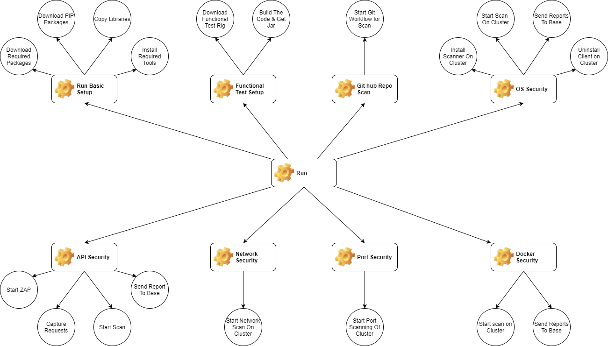

# mosip-security
This framework is designed for mosip e2e security. this framework will cover below security testings:

1. Basic setup of all the required tools, packages
2. Build latest functional testrig for Mosip
3. OS hardening of your complete cluster
4. Aggressive port scanning of your cluster
5. Port scanning of your domain
6. Network Scanning of your cluster
7. Docker scanning of your cluster
8. e2e API scanning for vulnerabilities 

#Requirements:
1. Ubuntu 18.04 or above, 16 GB RAM, 2 Cores, 120 GB hard-drive.
2. Install git on machine to clone the repo. 
3. Install ansible for running the script.
4. Create a sudo less user on machine.
5. Setup java on machine if Path is not set.

#start
1. Clone the repo.
2. Run playbook using ansible-playbook -i hosts.ini run.yml
3. Network scanning is available through OpenVAS. You can access the url @ https://<Your IP>:4000/.
4. Command line scripts for cluster scanning is in progress.

#Additional:
1. I has a Git workflow to scan all your repositories for secrets.
2. You need to add your github repository URL in batch.txt file.
3. Reschedule your workflow by changing time in repo-scanner.yml file.

#WorkFlow:

&nbsp;
&nbsp;&nbsp;&nbsp;&nbsp;

 
 
 

<b>Note:</b> Set ansible to run for localhost as well. If you want to run the test from putty or remote location. Please enable "X11Forward true" for server and for putty or any console.
 

Thanks for RoboZap python library